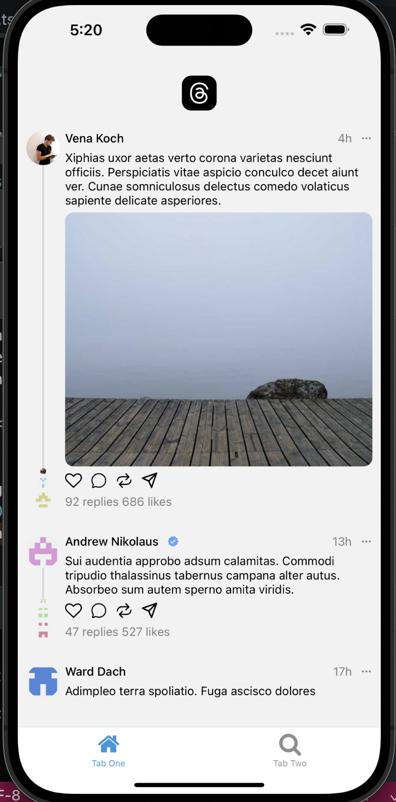

### To start the projecet

```
$> npx expo start
```

#### To upgrade the packages / dependencies

```
$> npx expo install -fix
$> npm update
$> npx expo start -c
```

### To autocomplete the routes

```
 <Link href="/<CTRL+SPACE> modal" asChild>
app.json - add:
"experiments": {
      "typedRoutes": true
    }
```

### Download threads animation from lottiefiles - winojourney

```
$> npm i lottie-react-native
$> npx expo install expo-image
$> npm i @faker-js/faker --save-dev
```

### Build for ios or android

```
$> npx expo prebuild --platform ios
```

### To run on ios

```
$> npm run ios
```

## Screenshot


